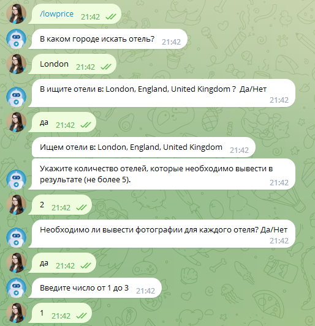
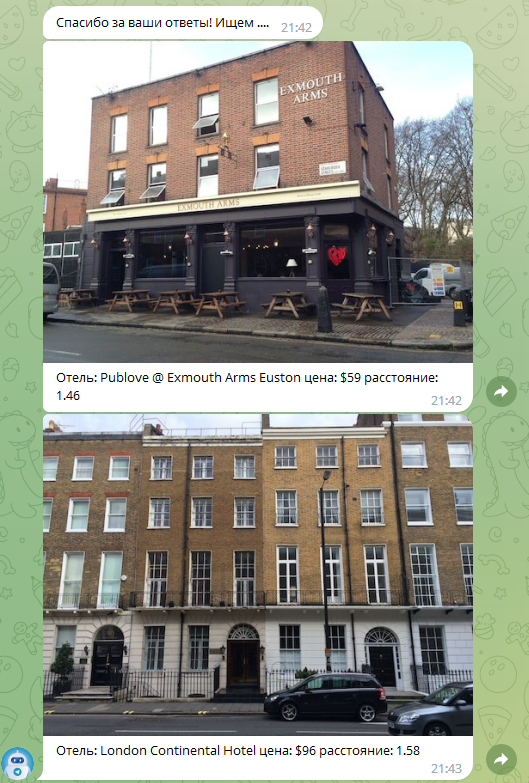
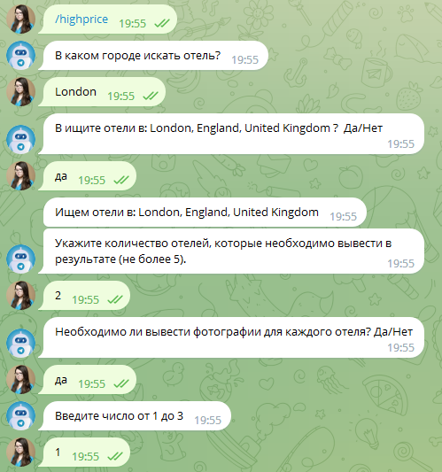
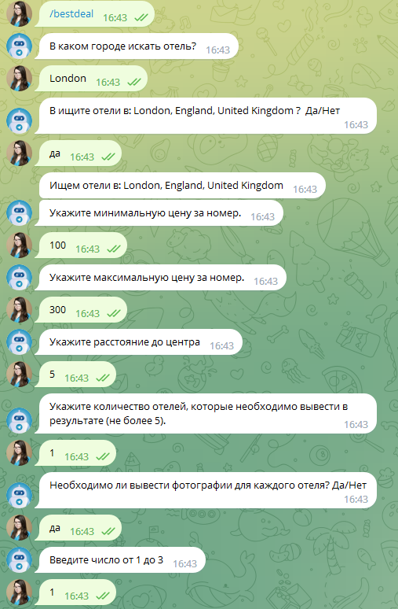
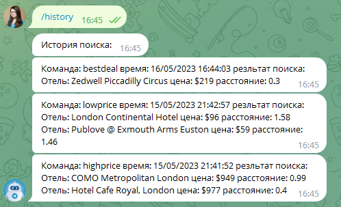

# Telegram-бот Too Easy Travel

## Последовательность работ

Установить зависимости
> pip install -r requirements.txt
Создать файл `.env` и добавить туда `BOT_TOKEN` `RAPID_API_KEY`

Запустить бота `python main.py`

## API и документации к ним

- [Документация API Hotels](https://rapidapi.com/apidojo/api/hotels4)
- [Документация API Telegram bots](https://core.telegram.org/bots)

## Возможности бота

Telegram-бот при запущенном Python-скрипте умеет воспринимать следующие команды:

- /hello_world - приветствие
- /help - помощь по командам бота
- /lowprice - вывод самых дешёвых отелей в городе
- /highprice - вывод самых дорогих отелей в городе
- /bestdeal - вывод отелей, наиболее подходящих по цене и расположению от центра
- /history - вывод истории поиска отелей

## Описание работы команд

### Команда /lowprice

После ввода команды у пользователя запрашивается:
1. Город, где будет проводиться поиск.
2. Количество отелей, которые необходимо вывести в результате (не больше
заранее определённого максимума).
3. Необходимость загрузки и вывода фотографий для каждого отеля (“Да/Нет”)
   - При положительном ответе пользователь также вводит количество
   необходимых фотографий (не больше заранее определённого
   максимума)

### Команда /highprice

После ввода команды у пользователя запрашивается:
1. Город, где будет проводиться поиск.
2. Количество отелей, которые необходимо вывести в результате (не больше
заранее определённого максимума).
3. Необходимость загрузки и вывода фотографий для каждого отеля (“Да/Нет”)
   - При положительном ответе пользователь также вводит количество
   необходимых фотографий (не больше заранее определённого
   максимума)

### Команда /bestdeal

После ввода команды у пользователя запрашивается:
1. Город, где будет проводиться поиск.
2. Диапазон цен.
3. Диапазон расстояния, на котором находится отель от центра.
4. Количество отелей, которые необходимо вывести в результате (не больше
заранее определённого максимума).
5. Необходимость загрузки и вывода фотографий для каждого отеля (“Да/Нет”)
   - При положительном ответе пользователь также вводит количество
   необходимых фотографий (не больше заранее определённого
   максимума)
   

### Команда /history

После ввода команды пользователю выводится история поиска отелей. Сама история
содержит:
1. Команду, которую вводил пользователь.
2. Дату и время ввода команды.
3. Отели, которые были найдены.

## Список библиотек

- aiogram==2.25.1
- aiohttp==3.8.4
- aiosignal==1.3.1
- asgiref==3.6.0
- async-timeout==4.0.2
- attrs==22.2.0
- Babel==2.9.1
- certifi==2022.12.7
- charset-normalizer==3.0.1
- coreapi==2.3.3
- coreschema==0.0.4
- tzdata==2023.3
- uritemplate==4.1.1
- urllib3==1.26.14
- yarl==1.8.2
